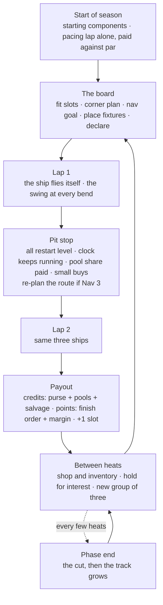
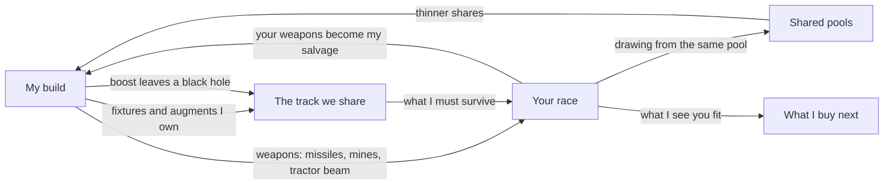

# The framework — Fast Ships Swing Wide

**This is the pinned framework.** It is round 7's design with every later
dictation worked in: each `supersedes` and `adds` row in `mechanics-notes.md`
is folded into the prose below, and each `open` row appears in **Open calls**
at the end rather than being decided quietly.

[Round 7](../rounds/round-07/sharpened.md) stays on disk exactly as it was —
rounds are append-only and are the record of how we got here. Where this
document and round 7 disagree, **this document wins**, and the disagreement is
listed in "What changed from round 7". Where this document and the catalogue
tables disagree, the tables win and this document is stale: the tables are the
dictated record.

## The game in brief

A season is a run of phases; a phase is several heats. A **heat** is one group
of three ships racing two laps, the same three ships both laps. The track is a
loop of **checkpoints**; the stretch between two checkpoints is a **sector**,
and a sector may offer several **splits** — paths through it that all end at
the same next checkpoint. Some checkpoints are **pit stops**: the race pauses,
every ship restarts together, and the player makes a few choices. There is
always a pit stop at the end of a lap, and no run between pit stops is longer
than about thirty seconds. The clock never resets; total time across every
sector decides the heat.

A ship is a set of **components** filling a limited number of **slots**. The
player does not drive. Between heats they buy, fit and plan; during a heat they
watch a tracking bar and, at pit stops, change their mind.

## The loop

## The ship

**Slots are the budget.** A ship starts with four and gains one for every race
it finishes; more can be bought with credits. There is no frame: a season opens
with an **initial budget** and a stocked shop, and the player deploys what they
choose. Components come in six
categories — **engines**, **shields and defensive systems**, **crew**,
**navigation**, **weapons and deployables**, **collection** — and a category
may be fitted more than once. Two shields is a build, not a mistake: the
collector shield's storage scales with the ship's _total_ shield capacity.

**Upgrades are where a component becomes itself.** A fitted component offers
upgrades in the shop, and a component that reaches level 3 often grows to take
a second or third slot. Most abilities arrive this way: at level 3 an engine
grants a boost, or the three-bend chain; at level 3 a collector shield starts
keeping what hits it. So the late build is a few deep components rather than
many shallow ones — with four starting slots, one maxed part is most of a ship.

**Thrust, Handling, Shields, Hull, Nav, charge and reaction are stats, not
parts.** Components move them. Reaction is still not bought: it comes from the
crew and falls with speed and hard acceleration.

**The shop is an inventory, not a moment.** Components are purchased, held in
the shop unfitted, added to the ship, removed from it, and sold. Slots are the
on-ship budget; the shop is the off-ship store.

## Speed, the swing and the corner plan

On a straight the ship accelerates at the rate Thrust gives, toward the top
speed Thrust gives. Every bend has a holding speed set by Handling: the fastest
it can be taken while staying on the path. The **corner plan** says what the
ship does about the difference — **Lift** brakes to the holding speed and takes
no swing, **Carry** enters at the speed it has and takes what comes, **Charge**
keeps accelerating for the most speed out, the widest swing and gravity on the
crew.

**The swing** is a seeded overshoot at every bend, its spread growing steeply
with speed carried over the holding speed. A small swing keeps the ship on the
path; a big one throws it wide for the rest of the sector, slower and among the
hazards. At a bend where a sector splits, a big enough swing carries the ship
into a split it did not plan.

Three things now bend that rule. An **ability can suspend the swing** — the
handling engine at level 3 takes the next three bends perfectly at top speed,
and pays extra speed for each bend reached within three seconds of the last. A
**hazard powered into** can push the ship into another split of the sector. And
a **weapon can push a ship off course** on any stretch of track, bend or not.
The swing is still the price of speed; it is no longer the only way to leave
the path.

**Gravity** is hard acceleration, and it acts on the crew _and_ on the ship.
Inertia dampeners reduce both.

## Navigation and the route

Navigation is the gate on the route, and it grades in levels rather than in
kinds:

| Nav | What it buys                                                                                                                                                   |
| --- | -------------------------------------------------------------------------------------------------------------------------------------------------------------- |
| 1   | You may select your direction at more splits.                                                                                                                  |
| 2   | Splits and sectors you have not seen — new growth, or an opponent's augment — are revealed, and you may set a direction on every split before the heat starts. |
| 3   | You may re-select split directions at any lap completion or pit stop. Takes a second slot.                                                                     |

Round 7's clear / dim / dark grading of a split survives as the thing Nav is
seeing through: a better system turns dark splits dim and dim splits clear.
What is new is that **changing your plan mid-heat is a Nav 3 privilege**, not
something every ship can do at a pit stop. Nav also takes a goal from the
board — lap time, collection or safety — and the better it is, the more it
bends the corner plan bend by bend toward that goal. When the crew is out, Nav
flies the ship alone, and a cheap one drifts wide at every bend.

## Crew

Crew are components, in five kinds, graded by **endurance** — how long they
last under gravity — and each carrying one other thing:

| Crew             | Endurance   | And                                        |
| ---------------- | ----------- | ------------------------------------------ |
| Human scientists | weak        | upgrades cost less                         |
| Engineers        | regular     | shields and abilities recharge faster      |
| Mercenaries      | —           | weapons do more damage and have more range |
| Androids         | very strong | navigation systems work better             |
| Nanites          | strong      | component expansion costs less             |

A worn crew acts slowly and then not at all; coasting recovers them and a pit
stop recovers a little more. Hurt crew cost credits to heal, replace or repair,
and the ship itself now has a maintenance bill alongside them.

## Damage, and what a shield can do

Shields take a hit first and regenerate, faster when coasting; above half they
deflect, costing damage but not speed. Hull is underneath, and gone, the ship
is out. Beyond absorbing, a shield can now do two other things depending on
what is fitted: **deflect a hazard** into a nearby ship or another hazard, by
chance, or **capture** the weapon or moving fixture that hits it at full
shields — and captured fixtures sell for credits when the race ends.

## The track

Checkpoints joined by sectors; a sector is a straight and bends, and some
sectors split. Down the middle runs the **golden path**, a bright ribbon where
every ship is faster and abilities charge. Wide is slower, with hazards that
hurt and pockets that pay.

**Black holes are terrain as well as hazard.** A corner can be caused by, or
sit near, a black hole — so a black hole shapes the track's geometry, not just
its danger. A ship built for them reads such a corner as an opportunity and
takes no damage from it at all.

The track starts the same for everyone and **grows between phases**: sealed
junctions open and new sectors are spliced in from the season seed, the added
sectors holding the darkest splits. As the loop grows, more checkpoints become
pit stops, so no run gets longer than about thirty seconds.

## What players put on the track

| Thing                                                                                  | Who sees it                                    | When it lands                             |
| -------------------------------------------------------------------------------------- | ---------------------------------------------- | ----------------------------------------- |
| **Fixture** — an object you own on a sector (beacon, slick, mine, relay)               | all three ships in your heat, before the start | bought between heats, placed on the board |
| **Fixture from an ability** — the dark matter engine's boost leaves a small black hole | nobody, until it bites                         | mid-race, wherever the boost fired        |
| **Augment** — a split, or a whole sector, that you add                                 | only players in the same heat                  | bought; one heat, or all season           |
| **Deployable weapon** — gravity mines, placed or pre-placed                            | not stated                                     | during the race, or set before it         |

The ability-made fixture is the odd one: it is placed while racing, it is not
announced, and it discriminates by build — it throws off only ships without a
dark matter engine.

## Money

Credits are the money. Points are the season standing and are never spent.

**Income:** the **purse** by finish order at the heat's end, the biggest sum in
the heat; **pools**, shared and capped under the purse, paying their lap's
share at each pit stop; **interest** on credits held through a pit stop, to a
cap; the **pacing lap**, paid against the track's benchmarks rather than
against anyone; **+1 slot** for every race finished; **dark matter** turned in
for credits at a pit stop or lap start, with a level 3 collector; and
**salvage** — captured fixtures sold when the race ends.

**Costs:** components, their upgrades, more slots, fixtures and augments, crew
healing, and ship maintenance.

Dark matter is no longer a pool. It is **inventory**: collected in the race,
spent recharging a dark matter engine's boost, or cashed in if the collector is
deep enough. That leaves the pool system thinner than round 7 drew it — bounty
by damage dealt is untouched, and whether solar is still a pool is an open
call below.

## Points, declarations and the cut

A heat scores once, by finish order on total time, plus a margin bonus for a
ship that finished close behind, so a close third is worth about twice a beaten
one. **Declarations** are bets made before the heat: the **Long Line** takes
the wide route at every split — win the heat with it and the bonus doubles with
extra credits, finish last and you lose points; **Hold the Line** is its
opposite, never leaving the path, void and costly if you swing wide once. At
the end of a phase, everyone below a set points line is out, however many that
is.

## How one player's choices reach another

Ships still do not touch. Everything below is interaction through the track,
the economy or the shop — which is what the brief asked for, and there is now
considerably more of it than round 7 had:

## What changed from round 7

| Round 7 said                                             | It now says                                                                | Why                                                                  |
| -------------------------------------------------------- | -------------------------------------------------------------------------- | -------------------------------------------------------------------- |
| A ship is six parts, one of each                         | A frame plus slotted components in six categories; a category may repeat   | Slots are the budget; stats are what components move                 |
| Section, route                                           | Sector, split                                                              | Vocabulary fixed by dictation                                        |
| Abilities fire on their own when the crew judges         | Abilities exist and arrive from upgrade levels; **who fires them is open** | The catalogue commits to abilities; the trigger does not             |
| The loop opens at the shop                               | It opens with starting components and a pacing lap                         | The pacing lap is the first sight of the track and the first credits |
| Owned routes, two kinds                                  | Augments may add a split **or a whole sector**                             | Dictated; the two named kinds are held off until named again         |
| Fixtures are bought pre-heat and shown to all three      | Also created mid-race by an ability, unseen and build-specific             | The boost's black hole                                               |
| Collectors open pools; dark matter pays by time off path | Dark matter is inventory, cashed in at a level 3 collector                 | Dictated as a collected resource with two sinks                      |
| The corner plan is the only lever on the swing           | An ability can suspend it; hazards and weapons can displace a ship         | Three dictated exceptions                                            |
| Gravity wears the crew                                   | Gravity acts on crew and ship                                              | Inertia dampeners name both                                          |
| Humanoid or robot                                        | Five crew, graded by endurance, each with a second effect                  | Dictated                                                             |
| Weapons hit "the nearest rival"                          | Weapons have range bands, and some displace rather than damage             | Dictated                                                             |
| Shields absorb, deflect above half                       | Also deflect hazards, and capture and sell what hits them                  | Dictated                                                             |
| The route is set before the heat and at break points     | Re-planning is a Nav 3 privilege                                           | Dictated                                                             |
| Nothing shapes the track's geometry                      | Black holes cause corners                                                  | Dictated                                                             |
| The shop is a moment between heats                       | The shop is an inventory: hold, fit, remove, sell                          | Dictated                                                             |

## Open calls

**Three were answered on 2026-09-13, when the build was planned.** They are
folded into the prose above and recorded in `mechanics-notes.md`:

- **Frames are cut.** A player starts with an **initial budget** and a shop
  already stocked, and chooses what to deploy. There is no named starting kit.
- **Abilities fire automatically** — on proximity to a rival, on track
  conditions, on the moment being right — *unless* an ability is specifically a
  placed one, in which case the player sets where its charge is spent before
  the run. Both kinds can exist; automatic is the default.
- **Opponents are bots** for the initial build, and the player races them.
  Real players are the destination, so nothing in the sim may assume the
  opponent's decisions are locally available at any particular moment.

Three remain, and are the owner's:

1. **Is solar still a pool?** The solar ion collector was dictated as a buff —
   speed and handling on the path, shields and recharge at level 3 — with no
   mention of collecting. Either solar stopped being a pool, or the collecting
   went without saying. With dark matter now inventory, this decides whether
   the pool system is two pools or one.
2. **Is the corner plan manual?** The owner asked whether slowing into a turn
   should just be automatic from components, nav and crew. The corner plan
   stands until they decide — but the handling engine's three-bend ability is
   now a second lever on the same thing, and the build tests the manual version
   first because it is the one you can see working.
3. **Does the cut ever fall between heats**, rather than only at a phase end?
   Raised in round 6, left open in round 7, untouched since.

## What the catalogue still wants

A few **plain** components — an ordinary engine, an ordinary shield, an
ordinary nav system. Every component dictated so far has a hook, and nothing is
merely competent, which makes a starting selection hard to picture and makes
the frames question harder to answer than it needs to be.
