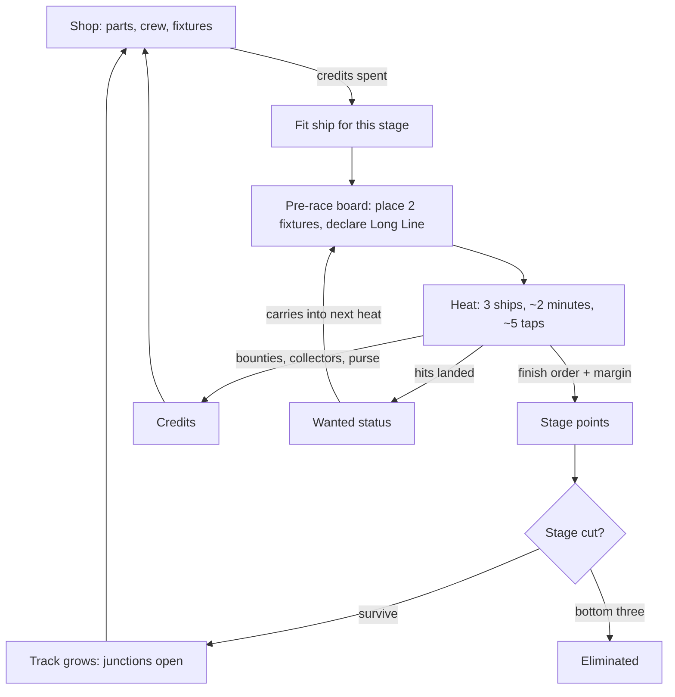
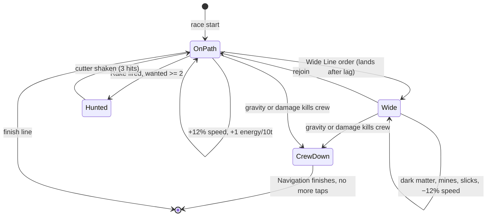

# Fast Ships Answer Late

## The idea, in one paragraph

A ship that is going fast has less time to react. That is the seed's first line
and it is the whole game, so make the player feel it directly: **an order you
tap lands late, and how late depends on how fast you are going.** Throttle up
and your ship is quicker but your hands are further from it. Burn hard and the
gravity presses your crew until they can barely act at all. The golden path
running down the course is where speed and energy are, so everybody wants to be
on it, and the interesting decisions are all about when to leave it — for a dark
matter pocket, for a shot at a rival, for a line a better navigation system
could hold and yours maybe cannot. Three ships to a heat, a season of stages, a
track that grows and only half-tells you how. You build between races. During a
race you tap about five times.

## The loop

## The systems

**The ship.** Six numbers, each 1–10, bought with credits. _Thrust_ sets top
speed. _Handling_ and _Navigation_ both buy back reaction lag, and Nav also
plans the line. _Hull_ is 100 points of structure. _Shields_ are 60 points that
regenerate 1 per 20 ticks and take damage first. _Crew_ is 60 points of people.
The sim runs at 30 ticks a second.

**Reaction lag.** The number that matters. When you tap an order, it executes
after a delay:

`lag = 8 + 30·(v/vmax)² − 2·Handling − 1·Nav`, floor 6 ticks.

At sixty percent throttle with average parts that is 6 ticks, a fifth of a
second — the tap feels instant. Flat out it is 23 ticks, three quarters of a
second, and you are aiming your taps ahead of where the ship is. Quadratic, as
the notes say, and flavoured as dilation: the fast ship's clock is not yours.

**Gravity.** Acceleration, not speed, makes gravity. While the ship is burning
above 60% of maximum acceleration, a humanoid crew's orders cost +50% lag and
the crew loses 1 health per 30 ticks. Two minutes of hard burn is 60 points and
a dead crew, so a full-burn build has to be a robot build or a short one.

**Crew.** Humanoid or robot. Robots ignore gravity entirely and have 90 health
instead of 60. Humanoids have 60 health and _improvise_: any order that would
land after a hazard has already hit has a 35% seeded chance to land in time
anyway. That is the notes' luck, made into one number a bot can measure.

**When the crew dies** the ship keeps racing and you stop tapping. Navigation
flies it home: Nav 7+ holds the golden path and loses nothing but your actives;
Nav 3 or less drifts wide and bleeds about 1.5 seconds a lap. A cheap nav system
is fine until the moment it is the only thing left.

**The golden path.** A ribbon down the course. On it: +12% speed and 1 ability
energy per 10 ticks. Off it: −12% speed, no energy, and every hazard in play.
The ship holds the path on its own; Handling and Nav set how wide a band it can
hold through a bend. Leaving is always a choice you make, never a mistake you
suffer, and the reason to leave is that some things are only out there.

**Actives.** Two fitted, 60 energy each. A path lap banks about 120, so you tap
roughly twice a lap and about five times a race. _Burn_ dumps energy into 4
seconds of overspeed, which also spikes the lag. _Wide Line_ takes an off-path
route through the next segment. _Rake_ fires at the nearest rival within range:
25 damage, and −8% speed on them for 3 seconds. _Brace_ spends energy to hold
the line through a hazard with no lag penalty.

**Shields deflect.** Above 50% shields, an off-path debris hit is deflected —
the damage lands but the ship keeps its speed. Below 50%, the same hit costs you
a second. That is why a wide-line build buys shields and a clean build does not.

**The course.** Stage 1 is one course, identical for everyone: eight segments, a
40-second lap, three laps. Four junctions are visibly sealed — a nebula edge, a
gravity well, a debris field, a station ring — and you can see what each would
open into. At each stage two more open, drawn from the season seed. Everyone in
the season gets the same evolution and nobody knows it in advance. Hints, no
certainty.

**Fixtures.** The seed's track mods and its pre-race placement are one system;
there is no reason for two. You buy fixtures in the shop and place two of them
on the pre-race board. They travel with you: your fixtures are on the track in
every heat you race, and in a three-way heat all six are on it and all six are
shown before the start. _Beacon_ widens the golden path 30% on its segment.
_Slick_ costs 15% speed to anything off-path there. _Mine_ does 18 damage to the
first ship through off-path. _Relay_ gives its owner 40 energy on each pass.

**Money.** A heat pays a purse — 100, 60, 30 — and three shared pools of 150
credits each, split by share, exactly as the notes want. The **solar pool**
splits by time on the golden path. The **dark matter pool** splits by time off
it. The **bounty pool** splits by damage dealt. Collectors are the equipment
that lets you draw from a pool at all: a Solar Vane, a Dark Matter Scoop, a
Grapple. Fit two of three. If all three ships fit Vanes and all three run clean,
each takes 50 and nobody got rich.

**Wanted and the cops.** Every Rake hit is +1 wanted, decaying 1 per stage. At
wanted 2 a cutter joins your heat, sits on your tail and costs you 6% speed
until you land three hits on it. At wanted 4 there are two. Aggression pays, and
then it charges rent.

**The season.** Nine players, three heats a stage, four stages. Points are 10 /
6 / 3, plus a margin bonus for anyone who did not win: +3 within 1 second of the
winner, +2 within 3, +1 within 6. A close third scores 6, a beaten third scores
3, and over four stages that gap is a stage of survival. Bottom three out after
stage 2 and again after stage 3; stage 4 is one heat of three.

## How they connect

Because lag is quadratic in speed, the player must decide how much of the race
to spend outside their own reach — the top of the throttle is where the ship is
fastest and least yours.

Because gravity kills humanoid crews and robots feel nothing, the player must
pick a crew that matches a throttle plan they have not raced yet.

Because energy only comes from the golden path and the dark matter pool only
pays off it, the player must choose which income they are building for before
the heat starts, not during it.

Because a dead crew hands the ship to Navigation, the player must decide whether
Nav is a luxury or the insurance on an aggressive build.

Because pools are shared three ways, the player must guess what the other two
ships fitted, and the answer changes as the field thins.

Because every fixture on the board is visible before the start, the player must
read six pieces of other people's strategy and route around them with two taps.

## A worked heat

Stage 2. The gravity well opened, so the lap is 60 seconds and you run it twice.
You are second on points, 4 behind. You fit a robot crew, Thrust 8, Handling 4,
Nav 3, a Dark Matter Scoop and a Grapple, and you place a Slick on the well exit
and a Mine behind it. You do not declare a Long Line.

The heat starts. The other two hold the path and you hold it with them for the
first minute, banking energy at flat throttle where your lag is 20 ticks and you
can feel it — your Brace on the debris field lands half a beat late and takes 12
hull. At the well you tap Wide Line early, on purpose, and swing into the dark
matter pocket. You lose 1.4 seconds and 8% of the solar pool, and you come out
with the scoop full and a rival two lengths ahead. Second lap: Rake, twice, into
the leader's shields. Wanted 2, a cutter arrives, you finish third by 0.9
seconds.

Third by under a second is 3 + 3 = 6 points, not 3. Plus 30 purse, 96 from a
dark matter pool nobody else contested, and 55 in bounty. You are 1 point
further back and 181 credits richer, and next stage you buy the Nav you skipped.

## What does not work, and what I would do instead

**Three laps at every stage.** Three laps of a track that grows every stage means
a race that grows every stage, and a five-minute race is not a phone race. Keep
three laps at stage 1, where the notes describe it, then hold total race time at
about two minutes: 3 laps of 40 seconds, then 2 of 60, then 1 of 120, then 1 of 150. The lap count falling is itself the sign that the track has grown.

**Passive collectors.** Solar and dark matter generating credits between races is
income without a decision, and it compounds for whoever is already winning. Keep
the collectors and the names, move them onto the track: a Solar Vane charges on
the golden path, a Dark Matter Scoop charges off it. Now the same fitting choice
that pays you also tells you which line to run.

**Randomness in elimination.** The notes ask for randomness to stop cutoffs
feeling flat, but a die roll at the cut punishes the player who built well and
makes the balance question unanswerable by bots. The margin points already do
the job the randomness was for — a close loss is worth twice a beaten one. For
the swing on top of that, add the **Long Line**: declare it on the pre-race
board and your ship runs the wide route all heat. Win with it declared and your
margin points double and you take +50 credits; finish third with it declared and
you lose 2 points. Chosen variance, fully deterministic, and a bot can tell you
exactly when declaring it pays.

**"Mods only apply to your own races."** As written this reads as a
contradiction, because every race has three players in it. The rule that works
is the one the parenthesis implies: fixtures are _carried_, not global. They are
on the track in every heat their owner is in, and in nobody else's. Six fixtures
per heat, all visible before the start.

## What I added

A tap is an order that takes time to land — the seed's reaction time made into
the thing the player's thumb actually feels, rather than a hidden stat.

Ability energy as a currency with a price: 60 per active, about 120 banked per
clean lap, so a race is five taps and each one costs a line.

A rule that can kill a crew: gravity fatigue at 1 per 30 ticks above 60%
acceleration, so "the crew died" is something a build causes, not flavour.

The shared pools given numbers — 150 each, split by share — and the collectors
turned into the equipment that opens each one.

Fixture types with effects, and the pre-race board where all six are shown.

The Long Line, as the replacement for randomness at the cut.

## What needs your call

**Is the lag the game, or is it one stat among six?** I have put the whole design
on it. If you wanted reaction time to stay a background number and the taps to
feel instant, say so and I will move the quadratic onto the ship's own line-holding
instead of the player's orders — but the game gets quieter.

**Nine players or twelve?** Nine gives clean thirds and a final heat of three.
Twelve gives four heats and a longer season, but the last cut leaves an awkward
field.

**Should Rake need line of sight?** Right now it hits the nearest rival in range
with no aiming. That keeps it to one tap. If you want aggression to be a skill
rather than a purchase, it should only fire when you are on the same line as the
target, which makes wide runners hard to hit and rewards staying close.

**How visible is the track's evolution?** I have two of four junctions opening
per stage, drawn from the season seed. You could instead let the players' own
fixtures decide which open, which makes the track a thing the field builds
together. Louder, and much harder to balance.
