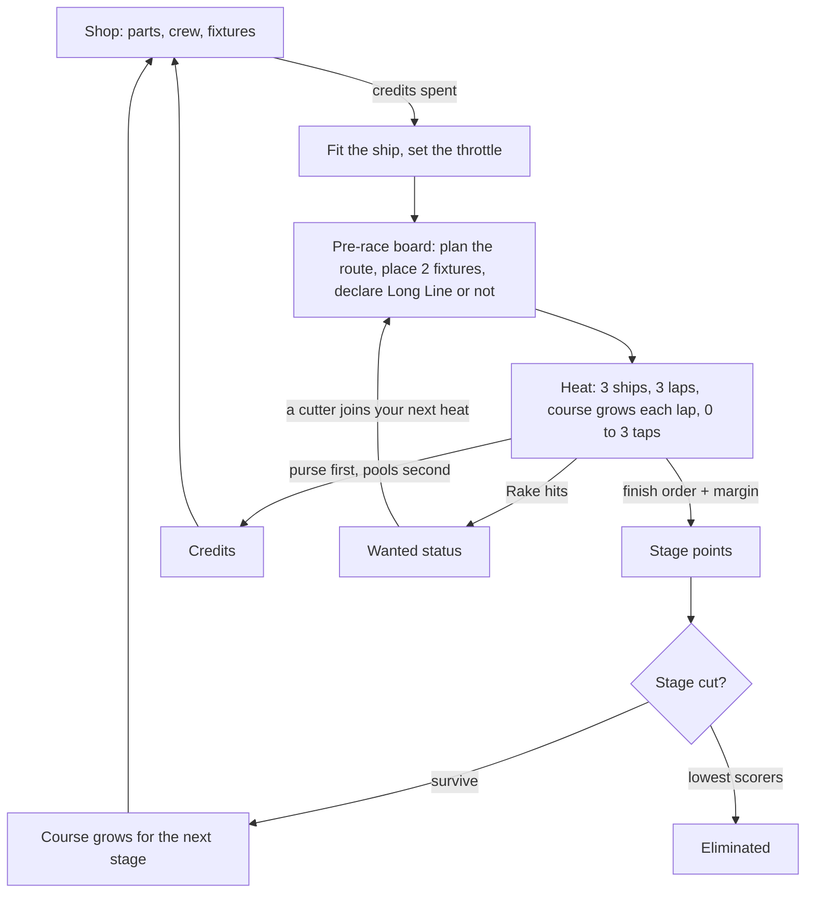
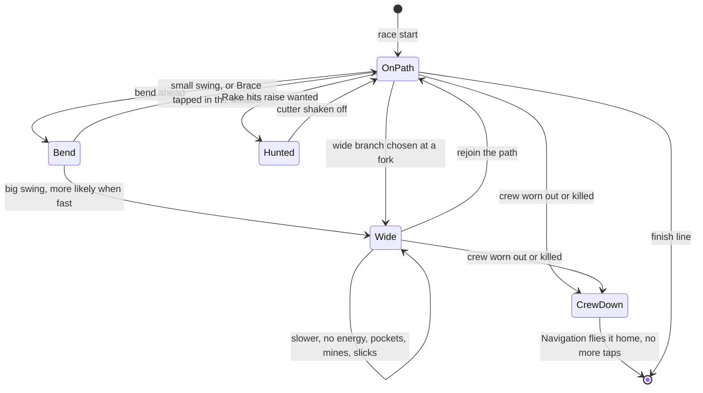

# Fast Ships Swing Wide

## The idea, in one paragraph

Ships race three laps of a course that grows a little every lap. Down the
middle of the course runs the golden path, a bright ribbon where every ship is
faster and where a ship collects the energy that pays for anything it does on
purpose. The whole game is one tension: **the faster a ship goes into a bend,
the wider it swings out of it, and how wide is partly luck.** Swing far enough
and you are off the path: slower, exposed, and among the things that are only
out there, such as pockets of dark matter, other players' mines, and a rival
close enough to shoot. Before a race you build the ship, choose a crew, plan a
route through the forks you can see, and place a couple of fixtures, which are
objects you own that sit on the course in every race you are in. During the race
the ship flies itself. You tap at most three times. Each tap is a call the crew
would have made anyway, made perfectly, if you tap inside a window that is wider
when your crew has more time to think. Three ships to a race, nine players to a
season, and after certain stages the lowest scorers are out.

## The loop

## The systems

**The ship.** Six parts, bought with credits: Thrust, Handling, Navigation,
Hull, Shields and Crew. Thrust sets how hard the ship can accelerate and how
fast it can go; on the pre-race board you set a throttle, from cruising to flat
out, and the ship holds it. Handling narrows the swing on bends. Navigation
reveals the course at planning time and chooses the line into each bend. Hull,
Shields and Crew are the three defensive layers. Shields take a hit first and
regenerate slowly, faster when the ship is coasting. Hull is the structure
underneath; when it is gone the ship is out. Crew is the people, worn down by
gravity and by hits that get through.

**Speed and the swing.** Every bend has a swing: a seeded draw of how far the
ship overshoots the golden path on the way out. The spread of that draw grows
with entry speed, and grows steeply, so a little more throttle is a lot more
swing. The flavour is time dilation: the fast ship's clock runs slow and the
bend arrives before the crew is ready. Handling shrinks the spread. A small
swing keeps the ship on the path. A big one throws it wide for the rest of the
segment. No two bends come out the same, but the odds are the player's to
shape: build for a narrow spread, or plan for where a wide one lands.
Navigation picks the side. A good nav system sets up each bend so that if the
ship does swing wide it swings toward the safest or most useful side, a
pocket rather than a mine field. There is nothing to tap early for; the swing
is not a delay, it is weather you dress for.

**Reaction time.** Not a part you buy. It is a number the ship carries moment
to moment: it starts where the crew sets it, falls as speed rises, and falls
further while the ship is accelerating hard. It governs how well the crew
handles events without being told. When a rival fires, the shields shift
toward the shot on their own; higher reaction catches more of it. Passing
through a pocket, reaction sets how full the collector gets. At a fork the
player did not plan for, reaction weights which way the crew goes. And it sets
the width of the tap window, below.

**Taps.** The ship collects energy on the golden path, roughly one tap's worth
per clean lap, so a three-lap heat is at most three taps, and a ship that ran
wide a lot may have fewer. You fit two of four actives, which are the things a
tap can do. _Brace_ cuts the swing on the next bend. _Rake_ fires a raking shot
down the side of the nearest rival; a Rake hit damages them, slows them for a
moment, and counts toward bounty and wanted status. _Burn_ is a short hard
overspeed on a straight; it wears the crew. _Scoop_ fills the collector fully
in the next pocket whatever your reaction is. Each active has a window: a
moment marked on screen as it approaches, wider when reaction time is higher.
Tap inside it and the crew does the thing at full effect. Tap outside it and
the energy is gone for nothing. Not tapping is always fine: the crew does the
same things on its own, as well as its reaction allows. A tap is the crew at
their best, bought with energy and timing. A fast ship needs the tap most and
has the narrowest window to make it in. That is the seed's speed-versus-
reaction trade, felt in the thumb.

**Gravity.** Acceleration makes gravity, and gravity wears a humanoid crew
down. Sustained means a lap of it: a ship that burns hard out of every bend for
a whole lap has a crew acting at about half, and a second lap like it leaves
them not acting at all. Coasting lets them recover, slowly. A robot crew
ignores gravity entirely. A crew worn to nothing does the same as a dead one,
below, until it recovers.

**Crew.** Humanoid or robot. A humanoid crew starts with higher reaction and
has luck: a seeded chance, once in a while, that a bad draw is redrawn, whether
it is a swing, a blind fork, or a shot. A robot crew has more health, ignores
gravity, starts with lower reaction and has no luck at all. **When the crew
dies** or is worn to nothing, the ship keeps racing and the player stops
tapping; no shields shift, no collecting, no calls at forks. Navigation flies
it home. A good nav system holds the golden path and loses only your taps; a
poor one drifts wide at every bend. A cheap nav system is fine until it is the
only thing left.

**The golden path.** A ribbon down the course. On it a ship is faster and
banks energy. Off it a ship is slower, banks nothing, and meets every hazard
and fixture in play. The ship holds the path on its own; Handling and Nav set
how tight a bend it can hold. Leaving is a choice, either planned at a fork or
suffered on a swing, and the reason to leave is that some things are only out
there.

**The course, its forks and the route.** The course is a loop of segments
with bends. Some segments fork: one branch stays on the path, the other goes
wide through a pocket or a hazard and rejoins later. On the pre-race board the
player plans the route, picking a branch at every fork they can see. Some
forks are not fully known. At a dim fork the player picks blind, choosing a
side without seeing what it holds. At a dark fork there is no pick at all: the
crew chooses at the moment, weighted by reaction time and crew type, and a
humanoid crew is the more random. A better nav system lights more of the
course at planning time, turning dark forks dim and dim forks clear. **The
course grows each lap.** Lap one is the base loop. On lap two a sealed
junction opens, a nebula edge or a gravity well, and a new section is spliced
in. On lap three another opens. Which ones open is drawn from the season seed
and is the same for every ship in the stage, so the variation in a heat is who
you are facing and what you chose. The added sections are where the darkest
forks are. Between stages the base loop itself grows, and the sealed junctions
you can see hint at what it will become without promising it.

**Fixtures.** The seed's track mods and its pre-race placement are one system.
You buy fixtures in the shop and place two on the pre-race board. They travel
with you: your fixtures are on the course in every heat you race and in no
heat you are not in, so a three-way heat has six fixtures on it, all shown
before the start. _Beacon_ widens the golden path on its segment. _Slick_
slows anything off the path there. _Mine_ damages the first ship through
wide. _Relay_ gives its owner a burst of energy on each pass.

**Shields deflect.** With shields above half, a hit from debris or a mine off
the path costs damage but not speed. Below half, the same hit also costs the
ship a beat. A build that plans to run wide buys shields; a clean build does
not need them.

**Money.** Winning the heat is the best business there is. A heat pays a
purse by finish order, and the purse is the biggest sum in the race. Under it
sit three shared pools, each split among the ships that drew from it by how
much they did the thing: the solar pool by time on the golden path, the dark
matter pool by time off it, the bounty pool by damage dealt. No pool, even
uncontested, pays one ship more than the gap between first and second place
purse. Collectors are the equipment that opens a pool: a Solar Vane charges
on the path, a Dark Matter Scoop charges off it, a Grapple charges on hits.
Fit two of three. If all three ships fit Vanes and all three run clean, they
split the solar pool thin and the winner is still the richest.

**Wanted and the cops.** Each Rake hit raises wanted status by a step; it
decays a step per stage. Past the first threshold a cutter, a police ship,
joins your next heat, sits on your tail and slows you until you shake it off
with a few hits. Past the second there are two. Aggression pays, then it
charges rent.

**The season and eliminations.** Nine players, three to a heat, four stages.
A heat scores points by finish order, plus a margin bonus for a ship that did
not win but finished close to the one that did, so a narrow third is worth
about twice a beaten third. After stage two, and again after stage three, the
three lowest on points are eliminated. Stage four is one heat of the last
three. The **Long Line** is declared on the board: it is a route that takes
the wide branch at every fork. Win with it declared and your margin bonus
doubles and you take extra credits; finish last with it declared and you lose
points. Chosen swing, fully seeded, and a bot can say when declaring it pays.

## How they connect

Because the swing spread grows steeply with speed, the player must decide how
much throttle they can afford to carry into bends they cannot fully see.

Because reaction time falls with speed and sets the tap window, the player
must choose between a ship that rarely needs the tap and a ship that needs it
and might miss it.

Because gravity wears a humanoid crew in a lap of hard burns, the player must
match the crew to a throttle plan they have not raced yet.

Because energy only comes from the golden path and the dark matter pool only
pays off it, the player must choose which income they are building for on
the board, not in the race.

Because a dead or worn-out crew hands the ship to Navigation, the player must
decide whether Nav is a luxury or the insurance on an aggressive build.

Because Nav also lights the forks at planning time, the player who skimps on
it plans a route with holes in it and lets the crew fill them.

Because pools are shared and capped under the purse, the player must guess
what the other two fitted, and still race for the win.

Because every fixture is visible before the start, the player must read six
pieces of other people's strategy and plan a route around them.

## A worked heat

Stage two. You are second on points, a little behind. You fit a robot crew,
high Thrust, middling Handling, a cheap nav system, a Dark Matter Scoop and a
Grapple, and you set the throttle high. On the board the lap-one loop is
clear and you plan the path branch at both forks. The lap-two section is dim;
you pick blind toward what looks like a pocket. The lap-three section is dark
to your nav and you leave it to the crew. You place a Slick on the gravity
well exit and a Mine behind it, and you do not declare the Long Line.

Lap one, everyone holds the path. On the second bend your draw is bad and you
swing wide, lose a length, and rejoin. Lap two, the well opens. Your blind
pick was a pocket: you tap Scoop inside a narrow window and come out full,
two lengths down. Lap three, the dark fork. Your robot crew goes with the
path, which is fine, and on the back straight the leader is alongside. You
tap Rake and hit, then Rake again and miss the window. Wanted rises a step. You
finish third, close.

A close third is worth about twice a beaten one, so you lose a little ground,
not a lot. The purse for third is small; the dark matter pool, which nobody
else drew from, pays you up to the cap; the bounty pool pays a little. The
winner is still richer than you. Next stage you buy the nav system you skipped,
because you want to see that third-lap fork before the crew picks it.

## What changed, and why

**Jargon.** "Order lands late" is gone with the mechanic it described. Rake is
defined where it appears: a raking shot at the nearest rival, and a Rake hit is
one that connects. Elimination is stated plainly in the season section: after
stages two and three, the three lowest on points are out.

**Numbers versus mechanics.** Every stat value, tick count, damage figure and
credit sum in the base is gone. What remains is counts that shape the game:
three ships, three laps, at most three taps, two fixtures, nine players, four
stages, and the one ratio a mechanic needs, that a close loss is worth about
twice a beaten one.

**Handling.** The base's central mechanic, a fixed delay before a tapped order
executes, is removed, and with it the base's title. In its place is the note's
sketch: on every bend the ship swings out by a seeded draw whose spread grows
steeply with speed and shrinks with Handling. This is the premise moving. The
base put the speed-versus-reaction trade on the player's thumb; this round
puts it on the ship's line, where a player cannot learn it away.

**Reaction time.** Now a derived number, from speed, acceleration and crew, that
governs how the crew handles events on its own: shields shifting toward a shot,
how much a pocket yields, which way the crew goes at an unplanned fork. The
note's extension is taken up: it also sets the width of the tap window.

**Tapping.** Energy from the path gives about one tap per clean lap, so a heat
is zero to three taps. Each tap is the crew doing at full effect something they
would have done anyway, and it only works inside a timing window. That is what
tapping does and why: it buys certainty from a crew that otherwise acts as
well as their reaction allows.

**Route planning.** The pre-race board gains the route. Clear forks are chosen,
dim forks are picked blind, dark forks are left to the crew, and Navigation
is what turns dark into dim into clear. Wide Line, the base's mid-race active
for leaving the path, becomes a branch you choose on the board.

**Laps.** Three laps every stage, as the seed and the note both want, and the
course grows each lap rather than between stages only. The base's falling lap
count is reverted.

**Economy defect.** The purse is the largest sum in a heat and no pool pays a
ship more than the gap between first and second purse. Third cannot leave
richer than first.

**Gravity defect.** Restated as the shape of a lap: a lap of hard burns halves a
humanoid crew's acting, a second lap stops it, coasting recovers it, robots
ignore it.

## What does not work, and what I would do instead

**Reaction lag, the base's core.** A fixed delay is a fixed thing to learn, as
the note says. Replaced by the swing above; the same trade, on the line instead
of the thumb.

**Wide Line as a tap.** With the route planned on the board, a mid-race order
to leave the path is redundant. Cut as an active; the wide branch at a fork is
the same choice made in advance.

**Passive collectors.** Still flagged from the base. Income between races is a
decision-free compounding advantage for whoever is ahead. Collectors stay, on
the track, as the equipment that opens a pool.

**Randomness at the cut.** Still flagged. A die roll at the cut punishes a good
build and makes balance unmeasurable. The margin bonus and the Long Line do the
job it was for, and this round adds a third source of seeded swing that the
seed did not have: the bend itself.

**"Mods only apply to your own races."** Still flagged as a contradiction with
three ships per race. Read as the parenthesis implies: fixtures are carried,
present in every heat their owner is in.

**The base's falling lap count.** Reverted per the note, which leaves the risk
it was solving: three laps of a growing course is a race that grows. The fix
is in the shape of the growth: a lap adds a section, not a loop, and the base
loop stays short, so a heat stays a couple of minutes at every stage. If it
does not, shorten the base loop, not the lap count.

**The base's pools.** They out-paid the purse. Capped, above.

## What I added

The swing as a seeded draw with a spread the player shapes, and Navigation
picking the side a wide swing lands on.

The tap window: a marked moment, wider with reaction time, inside which a tap
works and outside which it wastes energy.

Scoop as an active, so a wide-running build has something to tap for besides
Rake.

The route on the pre-race board, with clear, dim and dark forks, and the crew
deciding the dark ones.

The course growing lap by lap, with the darkest forks in the added sections,
so Navigation is worth more the longer the heat runs.

The pool cap under the purse.

## What needs your call

**How much of the swing does the player see?** The board could show the spread
band at each bend for the throttle you set, so the risk is legible before you
race it, or it could stay felt only. Legible is easier to balance and to
learn; felt is more of a story.

**Is one tap per lap the right rate?** Energy from the path gives zero to three
taps and fewer for a ship that runs wide. If you want the count to be a build
choice instead, make it a part: a bigger energy bank, bought with credits.

**Dark forks: crew pick or blind pick by default?** Right now a fork the nav
system cannot show at all is the crew's call. It could instead always allow a
blind pick, which keeps the player in charge but makes a cheap nav system less
of a gamble.

**Should Rake need line of sight?** Carried from the base. It hits the nearest
rival in range with no aiming, which keeps it one tap. If aggression should be
a skill, it should only fire when you are on the same line as the target, which
makes wide runners hard to hit.
